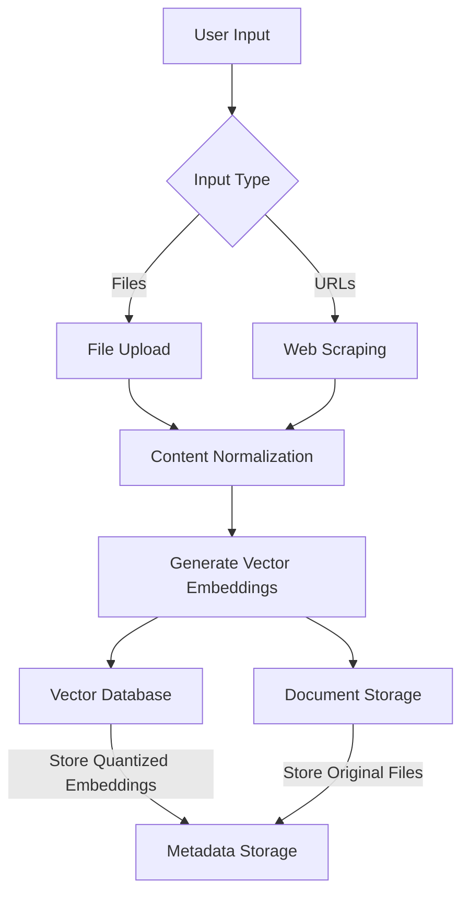

# 📚 Knowledge Base (RAG) AI-Powered Information Retrieval

## 🚀 Overview

The **Personal Knowledge Base** project is a **Retrieval-Augmented Generation (RAG)** powered AI system that allows users to **store, retrieve, and query** information using Natural Language Processing (NLP). It combines **vector search, file uploads, and web scraping** to provide precise and context-aware responses.

This system is designed to be an **efficient, scalable, and user-friendly solution** for managing personal or organizational knowledge.

---

## 🎯 Key Features

### ✅ **Dedicated User Space**

- Users can store and organize knowledge securely.
- Each user has their own isolated storage for documents and notes.

### 🧠 **AI-Powered Answer Generation**

- Leverages **RAG** to provide **context-aware** responses.
- Improves query accuracy with transformer-based NLP models.

### 🔍 **Vector Search for Semantic Understanding**

- Uses **vector embeddings** for similarity-based search.
- Finds relevant information based on **meaning** rather than just keywords.

### 📁 **File Upload Support**

- Supports **.txt, .pdf, .doc**, and other document formats.
- Ensures **consistent preprocessing and normalization** for enhanced retrieval.

### 🌐 **Web Scraping (Selenium, Playwright)**

- Allows users to fetch **web content** by providing URLs.
- Scraped content is stored for future retrieval.

### 📊 **Embedding Quantization for Efficiency**

- Reduces memory usage without compromising retrieval performance.

### 🔢 **Query-to-Vector Conversion**

- Converts user queries into vector embeddings using **transformer models**.
- Enables **fast and accurate** retrieval from stored knowledge.

### 🖥 **Intuitive Frontend with Authentication**

- **User-friendly interface** for document uploads, queries, and knowledge retrieval.
- Secure authentication (OAuth 2.0 / JWT) ensures data privacy.

### 💬 **Interactive Chat-Based Search**

- Users can **chat** with the system to query knowledge, upload files, and retrieve relevant information.
- Enhances usability with a **conversational interface**.

---

## 🏗️ Tech Stack

| **Category**       | **Technology**                             |
| ------------------ | ------------------------------------------ |
| **Frontend**       | React.js / Vue.js                          |
| **Backend**        | Python (FastAPI, Flask, Django)            |
| **Database**       | PostgreSQL / MongoDB                       |
| **Vector DB**      | Qdrant                                     |
| **AI/ML**          | Hugging Face Transformers (for embeddings) |
| **Web Scraping**   | Playwright                                 |
| **Authentication** | OAuth 2.0 / JWT                            |
| **Hosting**        | AWS / GCP / Azure                          |

---

## 🏛 Architecture

### 🖥 **Frontend**

- **User Authentication & Dashboard**
- **Chat Section for AI Interactions**
- **File Upload & Query Interface**

### 🔧 **Backend**

- **Database for File Storage**
- **Pre-trained Large Language Model (LLM)**
- **Vector Database for Fast Retrieval**
- **Transformer Model for Embeddings**

## 

---

## ⚙️ Workflow

1. **File Upload / Web Scraping**

   - Users upload files or provide URLs.
   - The system normalizes and preprocesses the content.

2. **Vector Embedding Generation**

   - Transformer models generate **semantic embeddings**.
   - The embeddings are stored in a **vector database**.

3. **Query Processing**

   - User queries are converted into vector embeddings.
   - The system retrieves **most relevant** information from the database.

4. **Results Presentation**
   - Results are presented in the **chat interface** or **UI dashboard**.

